# PocketPlant

  

<h5 align="center">An APP that helps those who love planting to record and to share your plants.</h5>
<h5 align="center">Check out others’ plants on PocketPlant and interact with each other.</h5>

    
    

	

  

## Features
#### Plant record
> Record plants information in detail and check it at any time.

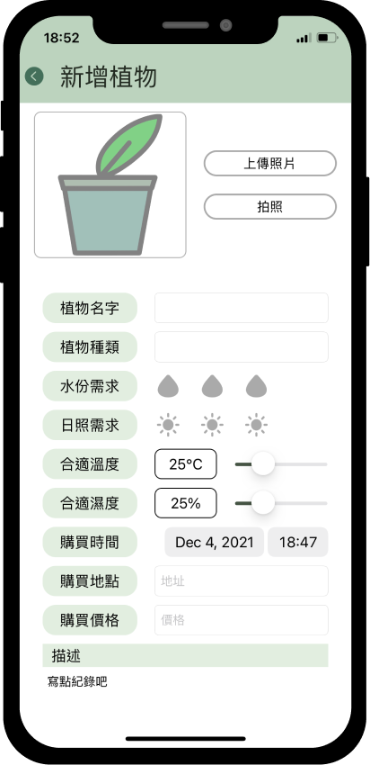 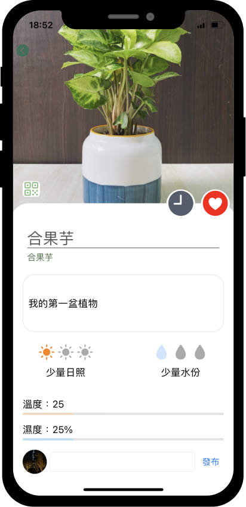

#### Daily watering record
> Quick and easy watering record for daily routine and check out detail in calendar page.

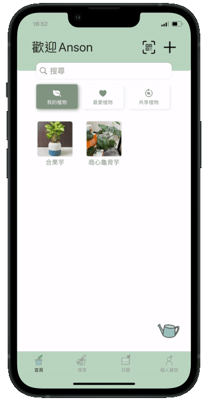 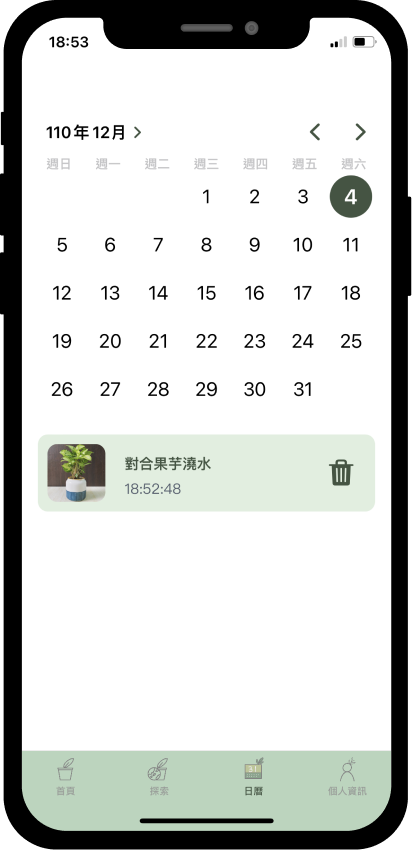 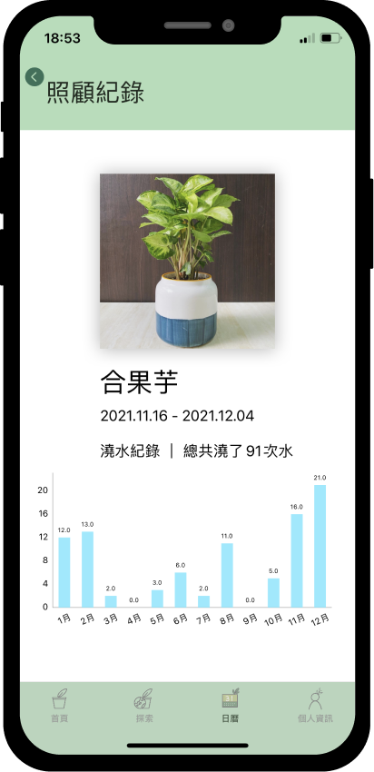

#### Share Plant with QRCode
> Use the plant's QRCode to share with your friends after scanning the QRCode you can store the plant into the share plants list.

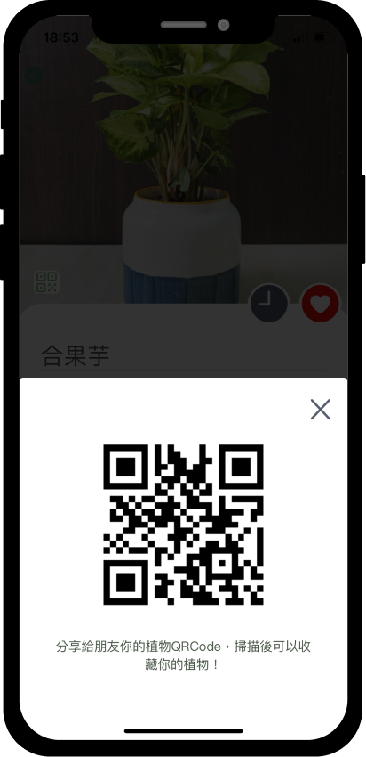 

#### Discover plants and gardening shops
> Explore other people's plants and favorite gardening shops. Don't forget to leave a comment on it.

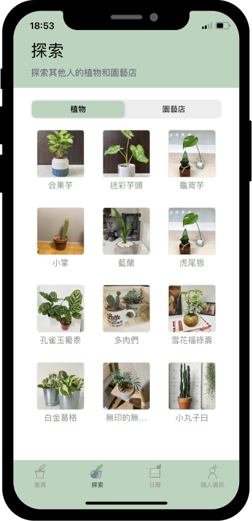 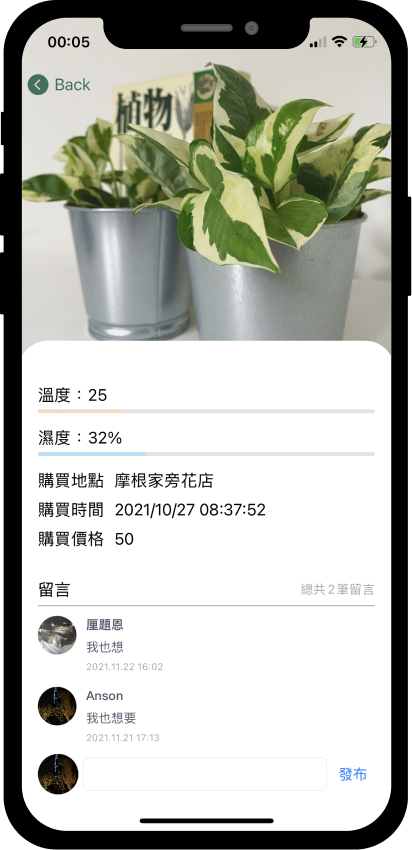

#### Tools stock record
> Tool material inventory record including where you bought and the stock number.

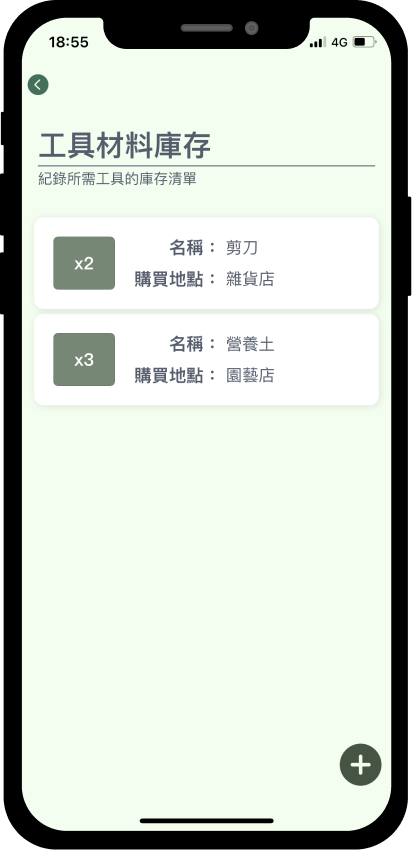 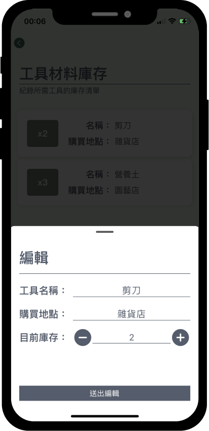

#### Favorite gardening shop list
> List of favorite gardening shops and show the place on the map.

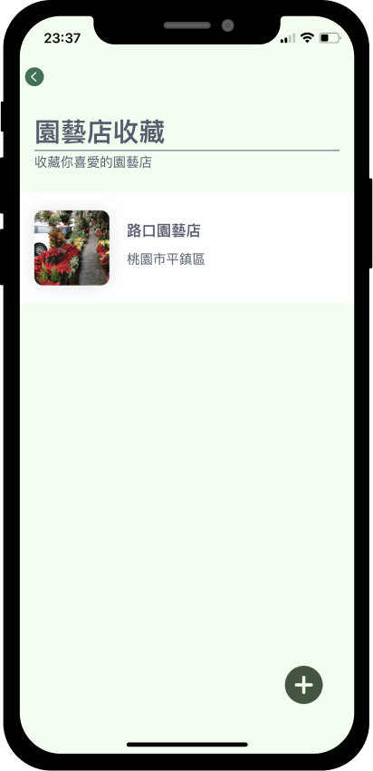 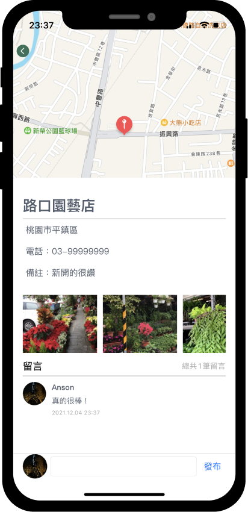

## Technical Highlights
- Used **`MVC`** and **`OOP`** design patterns to achieve expandable, readable, and maintainable program structure.
- Built APP UI in **`Storyboard`**, **`xib`**, and **`programmatically`**.
- Implemented **`UIPanGestureRecognizer`** and converted the movement to the position that users hover on.
- Used **`CIFilter`** to generate the unique QRCode for each plant.
- Used **`AVFoundation`** to implement the **`QRCode scanning`**.
- Used **`DispatchGroup`** to aggregate a set of tasks and synchronize consistency of data and UI.
- Implemented **`Sign in with Apple`** to provide users with secure and convenient login options.
- Managed user identity with **`Firebase Authentication`**.
- Used **`Firebase Firestore SDK`** for data management including storing the images on **`Storage`**.
- Implemented **`Local Notifications`** to remind the user of watering, fertilizing, and replenishing the soil at the user-defined time.
- Utilized **`Charts`** library to show watering records bar chart each month.

## Libraries
- [SwiftLint](https://github.com/realm/SwiftLint)
- [Kingfisher](https://github.com/onevcat/Kingfisher)
- [IQKeyboardManagerSwift](https://github.com/hackiftekhar/IQKeyboardManager)
- [Charts](https://github.com/danielgindi/Charts)
- [lottie-ios](https://github.com/airbnb/lottie-ios)
- [Firebase](https://firebase.google.com)

## Requirement
- Swift 5.0
- Xcode 13.0
- iOS 14.0 or higher

## Contact
HanPing Chiu anson19800@gmail.com